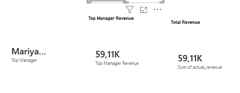
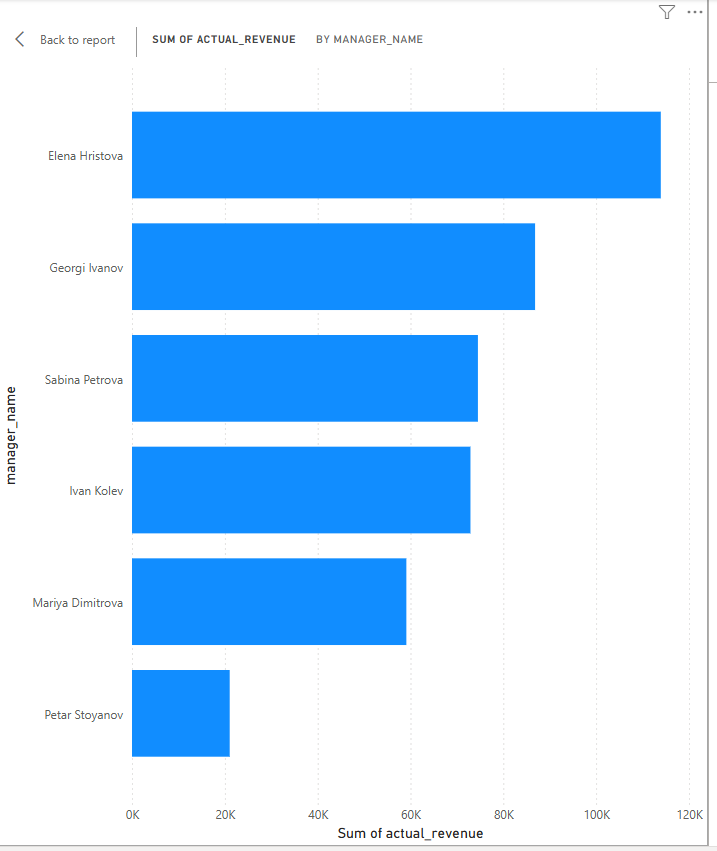
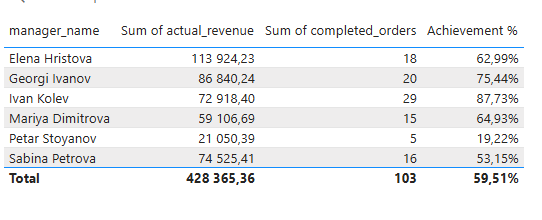

# KPI Automation Pipeline

## Overview
This project automates the generation and delivery of KPI reports using Python and PostgreSQL.

It replaces manual Excel-based reporting by extracting data from a database, validating it, generating formatted Excel reports, and sending them automatically via email.

Additionally, a Power BI dashboard is built on top of the generated data for business analysis and visualization.

---

## Dashboard Preview

### KPI Overview

Displays total revenue and the top-performing manager.

### Manager Performance

Compares revenue across managers to identify top and low performers.

### Detailed Metrics

Shows detailed KPIs including revenue, completed orders, and achievement percentage.

---

## Features
- SQL data extraction from PostgreSQL
- Data validation and cleaning (type handling, null checks)
- Automated Excel report generation
- Excel formatting (headers, column widths)
- Logging system for monitoring and traceability
- Automated email delivery with attachments
- Scheduled execution via Windows Task Scheduler
- Power BI dashboard for KPI visualization

---

## Tech Stack
- Python (pandas, sqlalchemy)
- PostgreSQL
- openpyxl
- smtplib
- python-dotenv
- Power BI

---

## Project Structure
- `main.py` – main pipeline logic
- `.env` – environment variables (not included in repo)
- `requirements.txt` – dependencies
- `run_kpi_report.bat` – automation script
- `reports/` – generated reports (ignored in Git)
- `images/` – dashboard screenshots for documentation

---

## How It Works
1. Extracts data from PostgreSQL using SQL
2. Validates and cleans the dataset in Python
3. Generates a structured KPI report in Excel
4. Saves the file with a dynamic timestamp
5. Sends the report via email automatically
6. Logs all steps for monitoring and debugging
7. Visualizes results in Power BI dashboard

---

## Automation
The pipeline runs automatically on a daily schedule using Windows Task Scheduler, eliminating manual intervention.

---

## Security
Sensitive data such as database credentials and email passwords are stored in a `.env` file and are excluded from the repository via `.gitignore`.

---

## Business Value
- Eliminates manual reporting effort
- Reduces human error
- Provides consistent and reliable KPI tracking
- Enables faster decision-making through automated insights

---

## Result
A fully automated reporting system that integrates data extraction, processing, reporting, and visualization in a single pipeline.